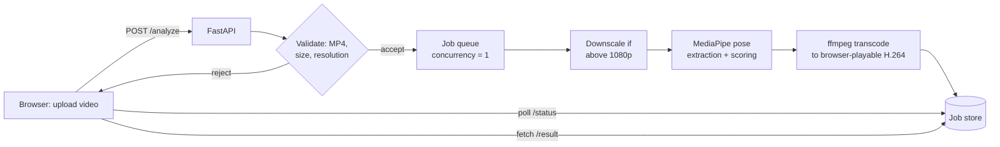
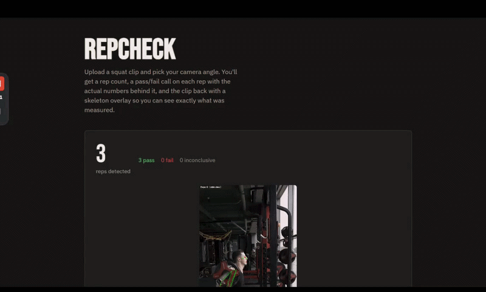

# RepCheck

A computer-vision squat form checker: upload a video, get back an annotated
clip with a skeleton overlay and a rep-by-rep pass/fail breakdown, backed by
a documented, evidence-based calibration process rather than guessed
thresholds.

## Why this project exists

Most portfolio CV projects stop at "the model works locally." This one is
built specifically to close a different gap: **shipping** a model as a real,
deployed, usable service — with the same rigor applied to the deployment
layer as to the CV pipeline itself. Every calibration decision in this repo
is backed by evidence and documented, including the checks that are
deliberately *disabled* for a given camera angle because the evidence showed
they don't work from that angle. See [`PROJECT_CONTEXT.md`](PROJECT_CONTEXT.md)
for the full calibration history, failed approaches, and open issues — this
README covers the product and how to run it.

## Features

- Upload a squat clip (MP4), pick front or side camera view
- Async job-based processing with live status polling — no request
  timeouts on longer clips
- Per-rep breakdown: depth, back angle, and knee alignment, each scored
  **only for the checks that camera angle can actually measure** (see
  [Calibration & limitations](#calibration--limitations))
- Annotated output video with skeleton overlay and a live pass/fail HUD
- Aggregate pass/fail tally across all reps in a clip
- Automatic cleanup: job data is deleted the moment you're done with it —
  explicitly, on page close, or via a TTL backstop — never kept longer than
  necessary

## How it works



Processing is deliberately **single-concurrency** with a bounded queue —
sized for a free-tier deployment, not for scale. See
[Deployment notes](#deployment-notes) for what was actually measured to
arrive at these limits, including the CPU constraint above.

## Tech stack

| Layer | Tools |
|---|---|
| Pose estimation | MediaPipe (Tasks API, `heavy` model), OpenCV |
| API | FastAPI, Uvicorn |
| Video processing | ffmpeg / ffprobe (transcoding, resolution probing) |
| Frontend | Plain HTML/CSS/JS — no framework, no build step |
| Deployment | Docker, Render (free tier) |

## Project structure

```
main.py              FastAPI app: job queue, validation, worker thread,
                      cleanup (TTL + explicit + best-effort on page close)
rep_counter.py        Core pipeline: pose extraction, rep detection
                      (hysteresis state machine), view-aware scoring
compute_angles.py     Angle math: knee angle, knee alignment, back angle,
                      landmark smoothing
thresholds.py         Calibrated thresholds, per camera view, with the
                      evidence behind every enabled AND disabled check
index.html            Frontend — upload, poll, results, video playback
requirements.txt      Python dependencies (opencv-python-headless in the
                      Docker image; see Dockerfile)
Dockerfile            Container build — see inline comments for why each
                      system dependency is there (several were found by
                      testing, not assumed upfront)
extract_landmarks.py  Standalone diagnostic tool (not part of the live
batch_process.py      pipeline) — used during calibration, kept for
                      future debugging
PROJECT_CONTEXT.md    Full Phase 1 calibration history and evidence trail,
                      plus the Phase 2 deployment findings
```

## Demo

**Live demo:** https://squat-rep-check.onrender.com — read the note below
before you click it.

## ⚠️ A note on speed — read this before judging the live demo

**The live demo is genuinely slow, and that's worth being upfront about
rather than letting someone discover it and assume it's broken.** Two
compounding reasons, both real and both measured, not guessed:

1. **Render's free tier gives 0.1 CPU** — a hard quota, 10% of one core,
   not a soft "shared" allowance. This isn't a corner someone cut; it's
   what's actually available at $0/month.
2. **The workload itself is inherently CPU-heavy**: frame-by-frame
   MediaPipe pose inference (the `heavy` model tier, chosen after testing
   showed visible tracking jitter on lighter tiers — see
   [`PROJECT_CONTEXT.md`](PROJECT_CONTEXT.md)) plus an `ffmpeg` re-encode
   pass, both genuinely CPU-bound, run back to back on every clip.

A clip that processes in under a minute on a normal desktop can take
several minutes on the deployed free tier. It will complete — timeouts are
set generously (7 minutes per stage) specifically so a real clip isn't
killed mid-process — but expect to wait. The service also spins down after
15 minutes of inactivity, so the very first request after a while adds
another ~30-60 seconds just to wake up.

**If you want to see it work without waiting**, see the demo below instead.



See full video here: [`Demo_RepCheck.mp4`](Demo_RepCheck.mp4)

## Running it yourself

### 1. Local development

**Requirements:** Python 3.11+, `ffmpeg`/`ffprobe` on PATH.

```bash
python -m venv venv
venv\Scripts\Activate.ps1        # Windows PowerShell
pip install -r requirements.txt
uvicorn main:app --reload
```

Open `http://127.0.0.1:8000/`.

> On Windows, if `ffmpeg -version` isn't recognized after installing (a
> common `winget` PATH-registration gap), set `FFMPEG_BIN`/`FFPROBE_BIN`
> to the full `.exe` paths instead of fighting PATH further — see the
> comments at the top of `main.py`.

## API reference

| Method | Path | Description |
|---|---|---|
| `GET` | `/` | Frontend |
| `POST` | `/analyze` | Submit a video (`multipart/form-data`: `video`, `view`) → `{job_id, status}` |
| `GET` | `/status/{job_id}` | Poll job status: `queued` / `processing` / `done` / `error` |
| `GET` | `/result/{job_id}` | Full JSON report (once `done`) |
| `GET` | `/result/{job_id}/video` | Annotated output video (once `done`) |
| `DELETE` | `/jobs/{job_id}` | Delete a job's data now (explicit or best-effort on page close) |

## Calibration & limitations

Every threshold here is either **evidence-based** (fit to a measured
good/bad gap in real data) or explicitly flagged as a **provisional
outlier-flag**, never presented as more validated than it is:

- **Depth** (both views) — evidence-based; the one check validated against
  a real good/bad separation in both a personal dataset and a 25-subject
  external dataset. Threshold: 65°, loosened from an originally-calibrated
  60° (still inside the validated good/bad gap; 65 itself isn't
  independently data-backed — see `thresholds.py` for the full note).
- **Back angle / lean** — enabled for **side view only**. Forward lean is a
  sagittal-plane motion a front camera structurally cannot observe;
  measuring it from the front was tried and produced false failures on
  genuinely good form. The side-view threshold is a loose outlier-flag
  (95th percentile of confirmed-good reps), not a tested pass/fail boundary.
- **Knee alignment (valgus)** — enabled for **front view only** (frontal-
  plane motion, not visible from the side). Calibrated from good-form clips
  only; never validated against a confirmed bad-alignment example.
- **Known open bug:** the knee-alignment guard rejects frames based on an
  absolute hip-width cutoff, which isn't scale-invariant — a clip filmed
  farther from the camera can be incorrectly flagged `insufficient_data`
  even with perfectly reliable tracking. Documented, not yet fixed.
- **View selection is manual** (front/side chosen by the person uploading),
  not auto-detected from the video.

Full reasoning, including approaches that were tried and explicitly failed,
is in [`PROJECT_CONTEXT.md`](PROJECT_CONTEXT.md).

## Deployment notes

Deployed on Render's free tier: **512MB RAM, 0.1 CPU** (a hard quota, not a
soft share — see the speed note at the top of this README), no persistent
disk. Real constraints this shaped, found by measuring rather than
guessing:

- **Memory scales with video *resolution*, not file size.** A small,
  highly-compressed 4K clip peaked far higher (and took ~3x longer to
  process) than a larger, lower-resolution one. Uploads are capped at
  1080p (checked by total pixel count, not a single width/height value —
  correct regardless of portrait/landscape orientation) and internally
  downscaled before processing.
- **0.1 CPU makes multi-threaded encoding counterproductive.** `ffmpeg` is
  explicitly pinned to a single thread — with no real parallelism
  available in a 10%-of-one-core quota, multiple threads just add
  scheduling overhead on top of an already-severe ceiling.
- **Processing is single-concurrency by design**, with a bounded job queue
  and per-stage timeouts (7 minutes each) generous enough that a real,
  slow-but-legitimate job completes rather than getting killed mid-process
  — while still preventing a genuinely hung job from blocking the queue
  forever. A hung job's timeout is soft, not a hard kill (Python threads
  can't be force-terminated) — documented as a known, accepted limitation
  in `main.py`.

## Dataset & attribution

Threshold calibration was tested against:

> *A Multi-View Raw Video Dataset of Seven Fitness Exercises with Good/Bad
> Form Labels*, Mendeley Data, DOI:
> [10.17632/kgbb3yn47p.2](https://data.mendeley.com/datasets/kgbb3yn47p/2),
> licensed CC BY 4.0.


This dataset's flat good/bad labels (mixing multiple, unrelated error types
per clip) were themselves a real finding — see `PROJECT_CONTEXT.md` for why
that limited what could be validated against it.

## License

This project is licensed under the MIT License

## Author

Hafiz Taha Hussain
